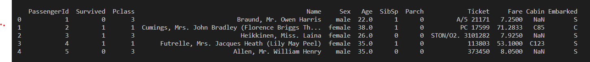
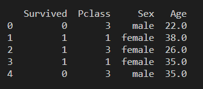
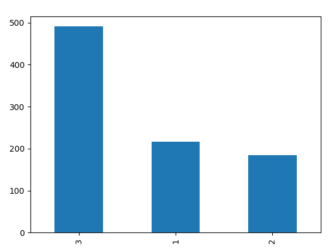

# Les series

## Importation de pandas

```python
import pandas as pd
```

## Pour ouvrir un fichier 

```python
data = pd.read_excel('Nom_du_fichier.xls')

# Ou alors

data = pd.read_csv('Nom_du_fichier.csv')
```

## Les différentes fonctions

```python
# Afficher le début du DataFrame
data.head() 

# Statistique rapides
data.describe()

# Supprime les colonnes
data.drop(['Nom_column','Nom_column',...])

# Supprime les lignes aux données manquantes
data.dropna(axis=0)

# Compter les répétitions
data.['Nom_column'].value_counts()

# Regroupe les colonnes
data.groupby(['Nom_column'])
```

## Vérifier les dimensions de notre fichier

```python
data.shape
```

## Voir les diférentes colonnes

```python
data.columns
```

## Voir les premiers lignes 

```python
data.head()
```

## Remplacer les valeurs manquantes

```python

# On complete les valeurs manquantes par
# La moyenne d'age

# Donc on modifie la réalitée

data.fillna(data['age'].mean())
```

## On supprime les données manquantes

```python
data.dropna(axis = 0)
```


# Passon a la pratique avec les données du titanic

## Importation de pandas et on ouvre le fichier

```python
import pandas as pd

data = pd.read_csv('data/titanic.csv')

print(data.head())

```



## Un peu de trie s'impose

```python
new_data = data.drop(['Name', 'PassengerId', 'SibSp', 'Parch', 'Ticket', 'Fare', 'Cabin', 'Embarked'], axis=1)

print(new_data.head())

# On supprime les données manquante

new_data = data.dropna(axis=0)
```



## Compter des données et les insérets dans un graphique

### Importation de metplotlib

```python
import matplotlib.pyplot as plt
```

### Compter les personnes dans les différentes classe

```python
new_data['Pclass'].value_counts()

# Résultat

3    491
1    216
2    184
```

```python
new_data['Pclass'].value_counts().plot.bar()

plt.show()
```




### Regrouper par sexe en calculant leur moyenne

```python
new_data.groupby(['sex']).mean()
```

### Regrouper par sexe et classe en calculant leur moyenne

```python
new_data.groupby(['sex', 'pclass']).mean()
```